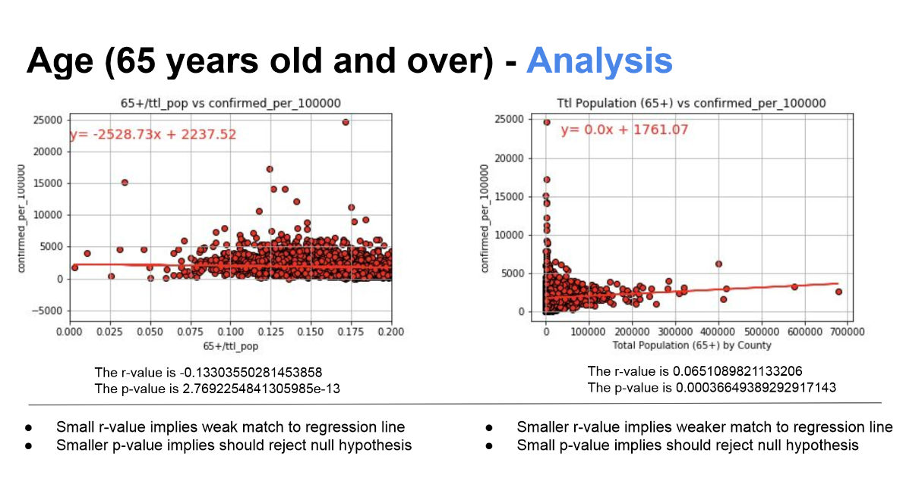
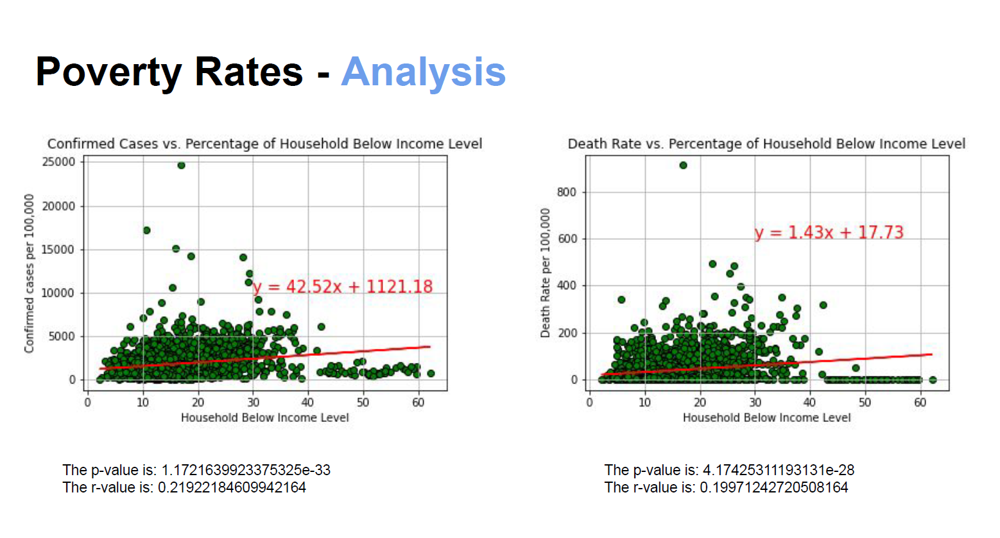

# COVID-19 Analysis

Group Members: Sybile Cherenfant, Megan Cogguillo, Vasudha Nai, Brandon Lee

Project description:

Our project analyzed county-level data from Johns Hopkins on COVID-19 cases and deaths, assessing the relationship between certain demographic characteristics and COVID outcomes.

In particular, we sought to understand:

  Do counties with older populations have higher case counts and/or death rates? (Brandon)
  
  Do counties with higher poverty rates have higher case counts / death rates? (Sybile)
  
  Do counties with limited health insurance coverage have higher cases counts / death rates? (Vasudha)
  
  Is there a relationship between political affiliation of each county (based on 2016 presidential election) and case counts / death rates? (Megan)

Age (65 years old and over) - Brandon

  Null Hypothesis: There is no relationship between the 65 and over group and COVID-19 cases and deaths.

  Alternative Hypothesis: The 65 and over group has a correlated effect on confirmed COVID-19 cases and deaths.
  
  

  

  In all cases, extremely low p-value suggests rejecting null hypothesis. therefore, we can say age has a role in cases and deaths, but based on plots, age is not a significant influence.

  In all cases, we hace well below 0.5 r-value, suggesting data does not fit regression line, illustrating there are many more factors with rising case and death rates. 

Poverty Rates - Sybile

  Null Hypothesis: There is no relationship between confirmed cases/death rates and poverty level

  Alternative Hypothesis: The higher the poverty level, the more confirmed cases and death rates in the U.S.

  

  P-value for both charts is < 0.05, meaning there is a relationship between poverty level and rate of confirmed cases and deaths. r-value for both charts is about 0.2 (weak positive linear regression model), meaning the relationship between poverty level and rate of confirmed cases/deaths is low. To sum it up, poverty alone does not impact the rate of confirmed cases/deaths. There are other variables that play a role in them.

Insurance Coverage - Vasudha

  Null Hypothesis: Population with no health insurance does not affect the case counts and/or death rates

  Alternative Hypothesis: The more the percentage of without health insurance, the more the confirmed cases and/or death rates

  

  

  

  Conclusions from the scattter plots and linear regression models indicate that COVID-19 deaths in various counties are weakly affected by the percentage of population without health insurance. the low p-values for all the plots implies that the null hypothesis should be rejected while the low r-values suggest that there is a weak correlation between population without health insusrance and case counts and/or death rates.

Red Counties vs. Blue Counties - Megan

  Null Hypothesis: 
  

  
  

